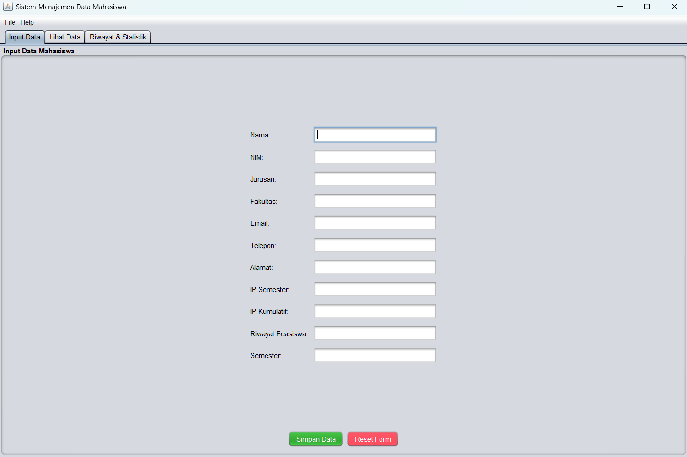
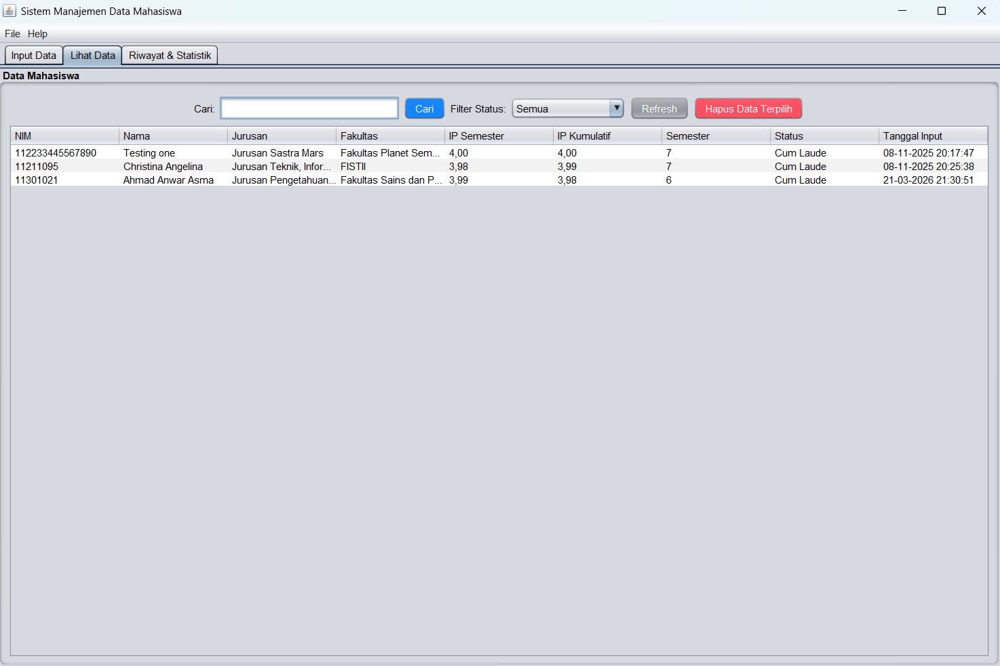
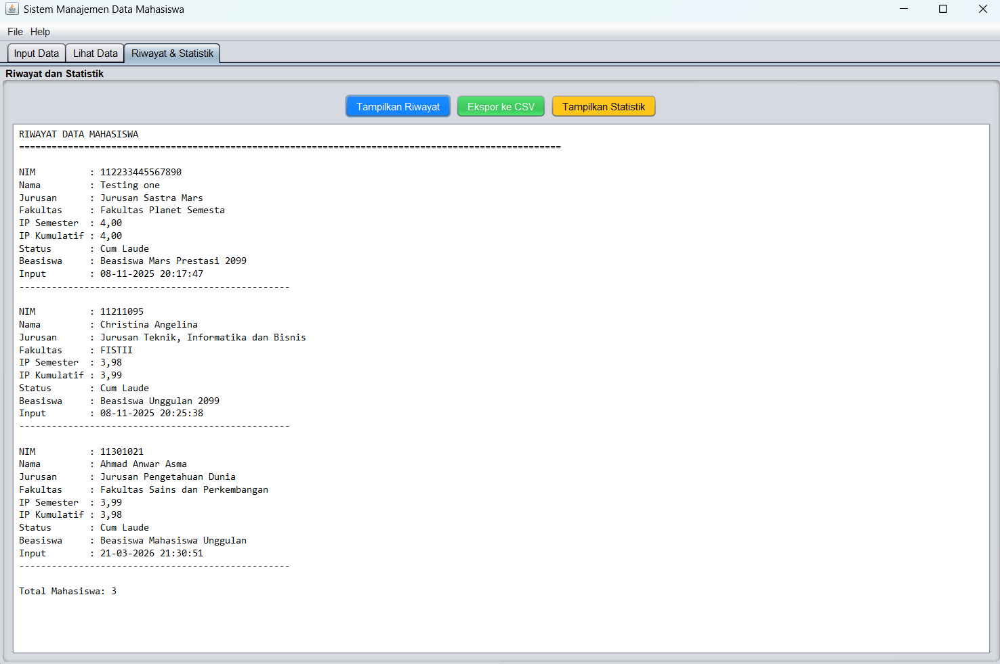
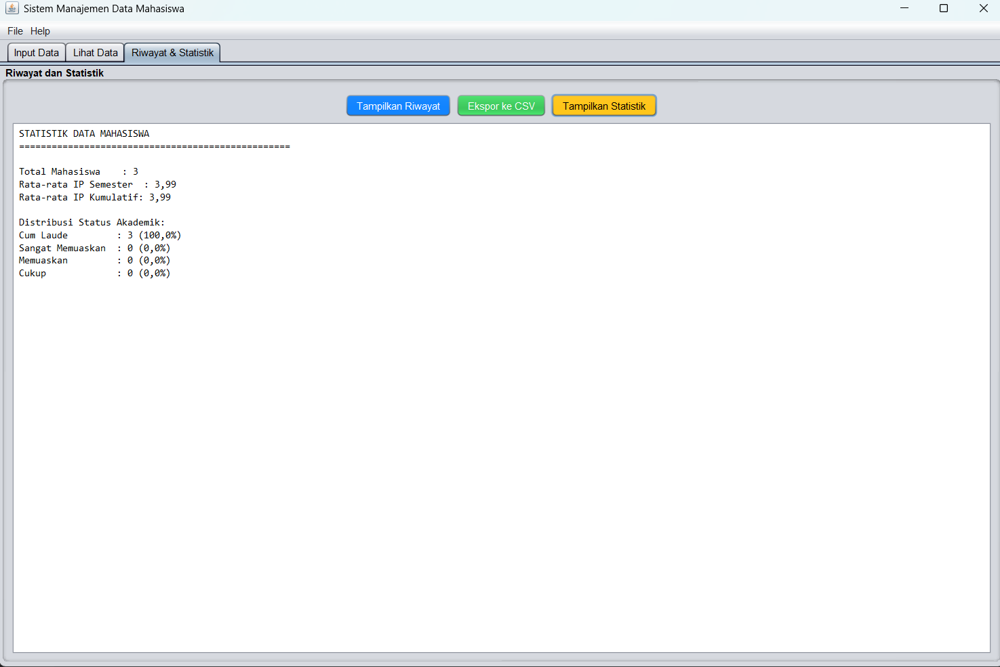

# 👨‍🎓 Sistem Manajemen Data Mahasiswa

<div align="center">

**Aplikasi manajemen data mahasiswa dengan fitur lengkap, pencarian, statistik, dan ekspor data**

</div>

## 📋 Deskripsi Proyek

**Sistem Manajemen Data Mahasiswa** adalah aplikasi desktop berbasis Java Swing yang dirancang untuk membantu institusi pendidikan dalam mengelola data akademik mahasiswa secara efisien. Aplikasi ini menyediakan solusi lengkap untuk pencatatan data mahasiswa, penilaian prestasi akademik, serta analisis statistik dengan antarmuka yang modern dan mudah digunakan.

Sistem ini memungkinkan pengguna untuk melakukan operasi CRUD (Create, Read, Update, Delete) pada data mahasiswa, dilengkapi dengan fitur pencarian, filter berdasarkan status akademik, penentuan status kelulusan otomatis berdasarkan IPK, serta ekspor data ke format CSV. Dibangun dengan pendekatan object-oriented programming dan penyimpanan data menggunakan serialisasi Java, aplikasi ini cocok digunakan untuk kelas, laboratorium, atau kebutuhan administrasi akademik.

Fitur utama aplikasi ini:
- **Pendaftaran Mahasiswa Baru**: Formulir lengkap dengan nama, NIM, jurusan, fakultas, kontak, dan nilai akademik
- **Manajemen Data**: Melihat, mencari, dan menghapus data mahasiswa
- **Filter Status Akademik**: Filter berdasarkan Cum Laude, Sangat Memuaskan, Memuaskan, Cukup
- **Statistik Akademik**: Rata-rata IPK, distribusi status, dan analisis prestasi
- **Riwayat Lengkap**: Tampilan detail semua data mahasiswa
- **Ekspor Data**: Menyimpan data ke file CSV untuk analisis lebih lanjut
- **Penyimpanan Otomatis**: Serialisasi data ke file untuk persistensi

## 📑 Daftar Isi

- [Deskripsi Proyek](#-deskripsi-proyek)
- [Tampilan Aplikasi](#-tampilan-aplikasi)
- [Latar Belakang](#-latar-belakang)
- [Fitur Utama](#-fitur-utama)
- [Teknologi yang Digunakan](#-teknologi-yang-digunakan)
- [Cara Penggunaan](#-cara-penggunaan)
- [Peran Developer](#-peran-developer)
- [Pembelajaran dari Proyek](#-pembelajaran-dari-proyek-lessons-learned)
- [Ucapan Terima Kasih](#-ucapan-terima-kasih)

## 📸 Tampilan Aplikasi

### Tampilan Input Data




### Tampilan Data Mahasiswa




### Tampilan Riwayat dan Statistik




### Tampilan Statistik




## 🎯 Latar Belakang

Proyek ini dibuat sebagai proyek pribadi untuk mengembangkan keterampilan dalam:
- **Pengembangan Aplikasi Desktop dengan Java Swing**: Mempelajari cara membuat antarmuka dengan JTabbedPane, JTable, JTextField, dan layout manager
- **Serialisasi Objek Java**: Mengimplementasikan penyimpanan data permanen dengan ObjectInputStream dan ObjectOutputStream
- **Manajemen Data dengan Collection Framework**: Menggunakan List, Stream API, dan lambda untuk operasi data
- **Pemrosesan CSV**: Mengekspor data ke format CSV untuk kompatibilitas dengan spreadsheet
- **Object-Oriented Programming**: Mengimplementasikan encapsulation, inheritance, dan design pattern Singleton

Kebutuhan yang melatarbelakangi proyek ini:
- **Kebutuhan pengelolaan data mahasiswa** yang terstruktur dan mudah diakses
- **Keinginan untuk memahami** konsep serialisasi dan persistence di Java
- **Kebutuhan alat administrasi** yang memiliki fitur statistik dan analisis

## 🌟 Fitur Utama

### 📝 **Pendaftaran Mahasiswa Baru**

| Fitur | Deskripsi | Implementasi |
|-------|-----------|--------------|
| **Data Diri** | Nama, NIM, jurusan, fakultas | `JTextField` dengan validasi |
| **Kontak** | Email, telepon, alamat | `JTextField` untuk informasi kontak |
| **Akademik** | IP semester, IP kumulatif, semester | `JTextField` dengan validasi numerik |
| **Beasiswa** | Riwayat beasiswa yang diterima | `JTextField` untuk catatan beasiswa |
| **Validasi** | Pengecekan NIM duplikat dan input kosong | Validasi sebelum simpan |

### 📊 **Penentuan Status Akademik Otomatis**

| IP Kumulatif | Status Akademik | Keterangan |
|--------------|-----------------|------------|
| ≥ 3.5 | Cum Laude | Pujian tertinggi |
| 3.0 - 3.49 | Sangat Memuaskan | Prestasi akademik sangat baik |
| 2.5 - 2.99 | Memuaskan | Prestasi akademik baik |
| < 2.5 | Cukup | Perlu peningkatan |

### 🔍 **Pencarian dan Filter**

| Fitur | Deskripsi | Implementasi |
|-------|-----------|--------------|
| **Pencarian Nama** | Mencari berdasarkan nama mahasiswa | `cariMahasiswaByNama()` dengan contains |
| **Filter Status** | Filter berdasarkan status akademik | JComboBox dengan 5 opsi |
| **Refresh Data** | Memuat ulang semua data | `refreshTable()` |

### 📈 **Statistik Akademik**

| Statistik | Deskripsi | Implementasi |
|-----------|-----------|--------------|
| **Total Mahasiswa** | Jumlah seluruh data | `getJumlahMahasiswa()` |
| **Rata-rata IPK** | Rata-rata IP kumulatif | Stream API dengan average() |
| **Distribusi Status** | Jumlah per status akademik | Perhitungan dengan switch |
| **Persentase Status** | Distribusi dalam persen | Perhitungan persentase |

### 💾 **Manajemen Data**

| Fitur | Deskripsi | Implementasi |
|-------|-----------|--------------|
| **Simpan Data** | Menyimpan ke file serialized | `ObjectOutputStream` |
| **Muat Data** | Memuat dari file saat startup | `ObjectInputStream` |
| **Backup Data** | Membuat backup dengan timestamp | `Files.copy()` dengan timestamp |
| **Hapus Data** | Menghapus data terpilih | Konfirmasi sebelum hapus |
| **Ekspor CSV** | Ekspor ke format CSV | `PrintWriter` dengan format CSV |

### 🎨 **Antarmuka 3 Tab**

| Tab | Fungsi | Komponen Utama |
|-----|--------|----------------|
| **Input Data** | Form pendaftaran mahasiswa | GridBagLayout dengan 11 field |
| **Lihat Data** | Tabel data dengan filter | JTable, JComboBox, JTextField |
| **Riwayat & Statistik** | Riwayat detail dan analisis | JTextArea, tombol aksi |

## 🛠️ Teknologi yang Digunakan

### Core Technologies

| Teknologi | Fungsi | Alasan Penggunaan |
|-----------|--------|-------------------|
| **Java 11+** | Bahasa pemrograman utama | Cross-platform, OOP support, Serialization |
| **Java Swing** | GUI Framework | Library bawaan Java, komponen lengkap |
| **Serialization** | Data Storage | Menyimpan objek Java ke file |
| **CSV** | Export Format | Format universal untuk spreadsheet |

### Library yang Digunakan

| Library | Fungsi | Penggunaan |
|---------|--------|------------|
| **javax.swing** | GUI components | `JFrame`, `JPanel`, `JTable`, `JTabbedPane`, `JComboBox` |
| **java.awt** | Layout and graphics | `GridBagLayout`, `FlowLayout`, `BorderLayout`, `Color` |
| **java.io** | File I/O | `ObjectInputStream`, `ObjectOutputStream`, `PrintWriter` |
| **java.util** | Collections | `ArrayList`, `List`, `Comparator`, `Stream` |
| **java.time** | Date/Time | `LocalDateTime`, `DateTimeFormatter` |
| **java.nio.file** | File operations | `Files.copy()` untuk backup |

### Penjelasan File

| File | Fungsi |
|------|--------|
| **Main.java** | Entry point aplikasi. Mengatur Look and Feel, membuat MainFrame, dan menampilkan welcome message. |
| **MainFrame.java** | JFrame utama dengan JTabbedPane yang mengorganisir 3 tab: Input Data, Lihat Data, dan Riwayat & Statistik. Dilengkapi menu bar. |
| **InputPanel.java** | Panel untuk input data mahasiswa dengan 11 field input menggunakan GridBagLayout. |
| **DisplayPanel.java** | Panel untuk menampilkan data dalam JTable dengan fitur pencarian, filter status, dan hapus data. |
| **HistoryPanel.java** | Panel untuk menampilkan riwayat detail dan statistik akademik dalam JTextArea. |
| **Mahasiswa.java** | Class model untuk entitas mahasiswa dengan atribut lengkap dan method penentuan status otomatis. |
| **DataManager.java** | Singleton class untuk mengelola koleksi data mahasiswa dengan method CRUD, pencarian, dan filter. |
| **FileHandler.java** | Class utilitas untuk menangani operasi file: simpan, muat, ekspor CSV, dan backup data. |

## 🎮 Cara Penggunaan

### Panduan Penggunaan Lengkap

#### 1. **Menambahkan Data Mahasiswa Baru**

1. Buka tab **"Input Data"**
2. Isi semua field yang tersedia:
   - **Nama**: Nama lengkap mahasiswa (wajib)
   - **NIM**: Nomor induk mahasiswa (wajib, unik)
   - **Jurusan**: Program studi
   - **Fakultas**: Fakultas tempat mahasiswa
   - **Email**: Alamat email
   - **Telepon**: Nomor telepon
   - **Alamat**: Alamat tempat tinggal
   - **IP Semester**: Indeks prestasi semester (0-4)
   - **IP Kumulatif**: Indeks prestasi kumulatif (0-4)
   - **Riwayat Beasiswa**: Catatan beasiswa yang diterima
   - **Semester**: Semester saat ini (1-14)

3. Klik tombol **"Simpan Data"**

4. Status akademik akan ditentukan otomatis berdasarkan IPK:
   - IPK ≥ 3.5: Cum Laude
   - IPK 3.0 - 3.49: Sangat Memuaskan
   - IPK 2.5 - 2.99: Memuaskan
   - IPK < 2.5: Cukup

5. Dialog sukses akan muncul dan form akan direset

#### 2. **Melihat Data Mahasiswa**

1. Buka tab **"Lihat Data"**
2. Semua data mahasiswa ditampilkan dalam tabel dengan kolom:
   - NIM, Nama, Jurusan, Fakultas, IP Semester, IP Kumulatif, Semester, Status, Tanggal Input

3. Gunakan fitur:
   - **Pencarian**: Ketik nama pada field "Cari" untuk mencari
   - **Filter Status**: Pilih status dari dropdown untuk filter
   - **Refresh**: Klik tombol "Refresh" untuk memuat ulang data

#### 3. **Menghapus Data Mahasiswa**

1. Pada tab **"Lihat Data"**, pilih baris yang akan dihapus
2. Klik tombol **"Hapus Data Terpilih"**
3. Konfirmasi penghapusan
4. Data akan dihapus dan tabel diperbarui

#### 4. **Melihat Riwayat dan Statistik**

1. Buka tab **"Riwayat & Statistik"**
2. Klik **"Tampilkan Riwayat"** untuk melihat semua data dalam format teks detail
3. Klik **"Tampilkan Statistik"** untuk melihat analisis:
   - Total mahasiswa
   - Rata-rata IP semester dan IPK
   - Distribusi status akademik (jumlah dan persentase)

#### 5. **Mengekspor Data ke CSV**

1. Klik **"Ekspor ke CSV"** pada tab **"Riwayat & Statistik"**
2. Pilih lokasi penyimpanan file
3. File CSV akan disimpan dengan header yang sesuai

#### 6. **Menu Aplikasi**

- **File** → **Backup Data**: Membuat backup file data dengan timestamp
- **File** → **Ekspor ke CSV**: Ekspor data ke file CSV
- **File** → **Keluar**: Keluar dari aplikasi (data otomatis tersimpan)
- **Help** → **Tentang**: Informasi versi dan fitur aplikasi

### Validasi Input

| Kesalahan | Pesan Error |
|-----------|-------------|
| Nama atau NIM kosong | "Nama dan NIM harus diisi!" |
| NIM sudah terdaftar | "NIM sudah terdaftar!" |
| Format IP atau semester tidak valid | "Format angka tidak valid!" |

### Tips Penggunaan

1. **Isi semua field** untuk data yang lengkap
2. **Gunakan NIM unik** untuk setiap mahasiswa
3. **Manfaatkan filter status** untuk melihat distribusi prestasi
4. **Export data secara berkala** untuk backup
5. **IPK dan IP Semester** menggunakan rentang 0-4

## 👨‍💻 Peran Developer

Sebagai developer proyek pribadi ini, saya bertanggung jawab atas:

### Peran dalam Proyek

| Area | Kontribusi |
|------|------------|
| **Perencanaan** | Merancang fitur-fitur manajemen data mahasiswa |
| **Database Design** | Mendesain struktur data dengan class Mahasiswa dan DataManager singleton |
| **GUI Development** | Membangun antarmuka dengan Swing (JTabbedPane, JTable, GridBagLayout) |
| **Serialization** | Implementasi penyimpanan data dengan ObjectInputStream/OutputStream |
| **CSV Export** | Membuat fitur ekspor data ke format CSV |
| **Statistik** | Mengimplementasikan analisis data dengan Stream API |
| **Validasi** | Validasi input dan penanganan exception |

### Fokus Pengembangan

1. **Fungsionalitas Inti**
   - CRUD lengkap untuk manajemen mahasiswa
   - Status akademik otomatis berdasarkan IPK
   - Pencarian dan filter yang responsif

2. **User Experience**
   - Layout 3 tab untuk organisasi konten
   - Tabel dengan scrolling dan seleksi baris
   - Dialog konfirmasi untuk operasi destructive

3. **Data Management**
   - Persistensi dengan serialisasi Java
   - Backup data dengan timestamp
   - Ekspor CSV untuk kompatibilitas

## 📚 Pembelajaran dari Proyek (Lessons Learned)

### Keterampilan Teknis yang Diperoleh

#### 1. **Serialisasi Objek Java**
```java
public static void simpanData() {
    try (ObjectOutputStream oos = new ObjectOutputStream(
            new FileOutputStream(FILE_NAME))) {
        oos.writeObject(DataManager.getInstance().getDaftarMahasiswa());
    } catch (IOException e) {
        showErrorDialog("Error menyimpan data: " + e.getMessage());
    }
}

@SuppressWarnings("unchecked")
public static void muatData() {
    try (ObjectInputStream ois = new ObjectInputStream(
            new FileInputStream(FILE_NAME))) {
        List<Mahasiswa> data = (List<Mahasiswa>) ois.readObject();
        for (Mahasiswa mhs : data) {
            DataManager.getInstance().tambahMahasiswa(mhs);
        }
    } catch (IOException | ClassNotFoundException e) {
        showErrorDialog("Error memuat data: " + e.getMessage());
    }
}
```

#### 2. **Singleton Pattern**
```java
public class DataManager {
    private static DataManager instance;
    
    private DataManager() {
        this.daftarMahasiswa = new ArrayList<>();
    }
    
    public static DataManager getInstance() {
        if (instance == null) {
            instance = new DataManager();
        }
        return instance;
    }
}
```

#### 3. **Stream API untuk Statistik**
```java
public double getRataRataIPK() {
    if (daftarMahasiswa.isEmpty()) return 0.0;
    return daftarMahasiswa.stream()
            .mapToDouble(Mahasiswa::getIpKumulatif)
            .average()
            .orElse(0.0);
}

public List<Mahasiswa> cariMahasiswaByNama(String nama) {
    return daftarMahasiswa.stream()
            .filter(m -> m.getNama().toLowerCase().contains(nama.toLowerCase()))
            .collect(Collectors.toList());
}
```

#### 4. **JTable dengan DefaultTableModel**
```java
String[] columnNames = {"NIM", "Nama", "Jurusan", "Fakultas", "IP Semester", 
                        "IP Kumulatif", "Semester", "Status", "Tanggal Input"};

tableModel = new DefaultTableModel(columnNames, 0) {
    @Override
    public boolean isCellEditable(int row, int column) {
        return false; // Table tidak bisa diedit langsung
    }
};

table = new JTable(tableModel);
```

#### 5. **GridBagLayout untuk Form Kompleks**
```java
JPanel formPanel = new JPanel(new GridBagLayout());
GridBagConstraints gbc = new GridBagConstraints();
gbc.insets = new Insets(5, 5, 5, 5);
gbc.anchor = GridBagConstraints.WEST;
gbc.fill = GridBagConstraints.HORIZONTAL;

gbc.gridx = 0; gbc.gridy = 0;
formPanel.add(new JLabel("Nama:"), gbc);
gbc.gridx = 1;
formPanel.add(txtNama, gbc);
```

#### 6. **Ekspor ke CSV dengan Format yang Benar**
```java
public static void eksporKeCSV(String fileName) {
    try (PrintWriter writer = new PrintWriter(new FileWriter(fileName))) {
        // Header
        writer.println("NIM,Nama,Jurusan,Fakultas,IP Semester,IP Kumulatif,"
                     + "Riwayat Beasiswa,Email,Telepon,Alamat,Semester,Status,Tanggal Input");
        
        // Data dengan handling quote untuk string yang mengandung koma
        for (Mahasiswa mhs : DataManager.getInstance().getDaftarMahasiswa()) {
            writer.printf("%s,\"%s\",\"%s\",\"%s\",%.2f,%.2f,\"%s\",\"%s\",\"%s\",\"%s\",%d,\"%s\",\"%s\"%n",
                    mhs.getNim(), 
                    mhs.getNama().replace("\"", "\"\""), 
                    // ... field lainnya
            );
        }
    }
}
```

### Soft Skills yang Dikembangkan

#### 1. **Object-Oriented Design**
- Mendesain class dengan tanggung jawab yang jelas (Mahasiswa, DataManager, FileHandler)
- Menggunakan Singleton pattern untuk manajemen data
- Encapsulation dengan private fields dan public getters

#### 2. **Data Management**
- Memahami konsep serialisasi dan persistensi
- Backup dan recovery data
- Ekspor ke format yang kompatibel

#### 3. **User Experience Design**
- Organisasi informasi dalam 3 tab
- Validasi input yang informatif
- Dialog konfirmasi untuk operasi penting

## 🙏 Ucapan Terima Kasih

### Sumber Daya dan Referensi

#### Dokumentasi Resmi
- [Java Documentation](https://docs.oracle.com/en/java/) - Bahasa pemrograman
- [Java Swing Tutorial](https://docs.oracle.com/javase/tutorial/uiswing/) - GUI framework
- [Java Serialization](https://docs.oracle.com/javase/tutorial/jndi/objects/serial.html) - Serialisasi objek

#### Tutorial dan Artikel
- **Oracle Java Tutorials** - Tutorial Swing dan Collection Framework
- **Stack Overflow** - Solusi untuk berbagai masalah coding
- **Java Code Geeks** - Contoh implementasi serialisasi dan CSV

#### Tools yang Membantu
- **GitHub** - Hosting repository dan version control
- **IntelliJ IDEA** - IDE untuk pengembangan Java

---

<div align="center">

**⭐ Jika proyek ini membantu pengelolaan data akademik Anda, berikan bintang! ⭐**

**"Data mahasiswa yang terkelola dengan baik adalah fondasi pengambilan keputusan akademik yang tepat"**

</div>