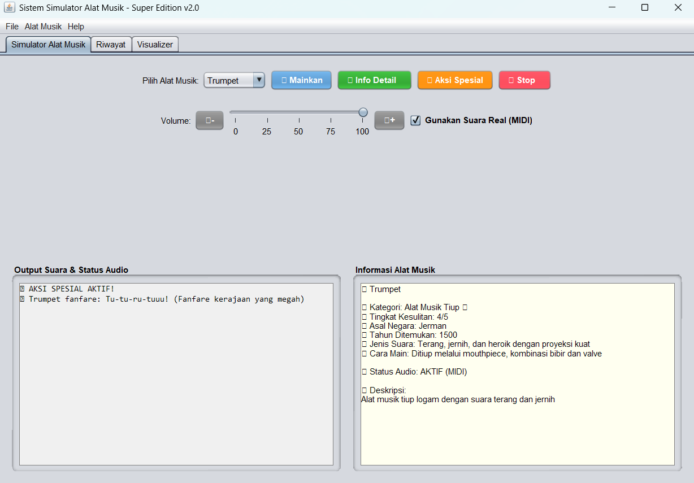
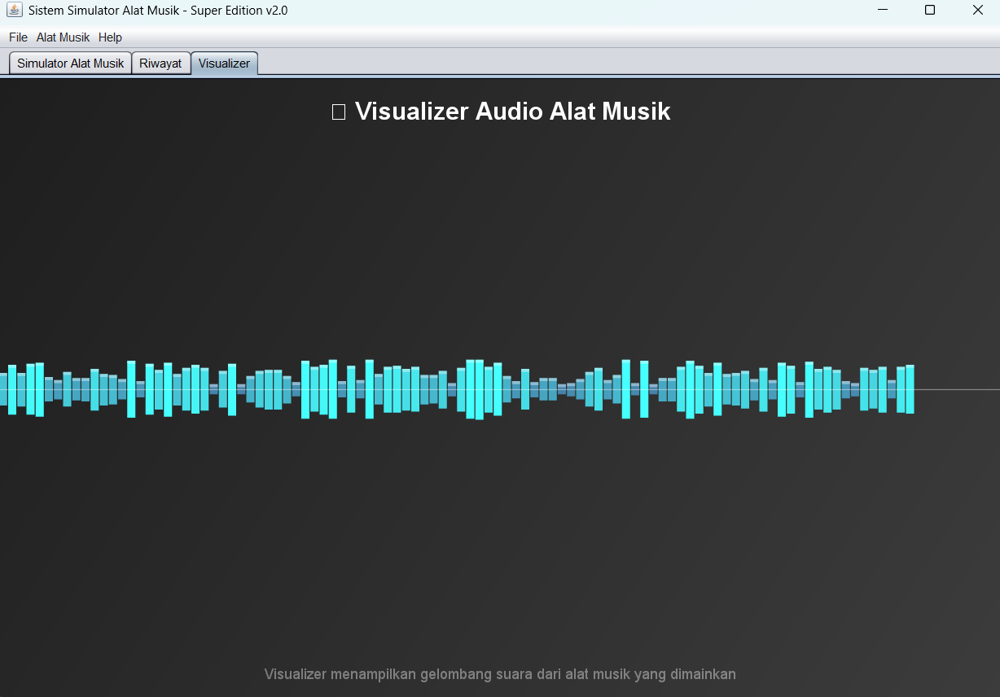
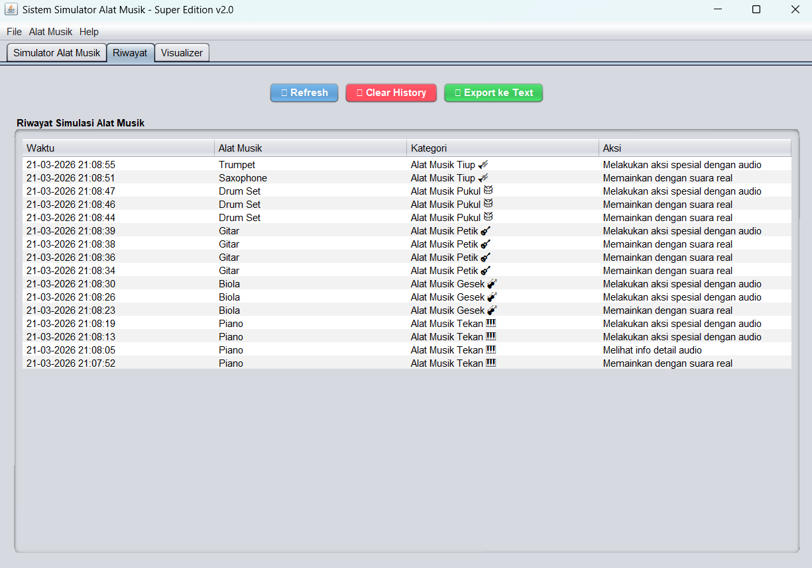

# 🎵 Sistem Simulator Alat Musik

<div align="center">

**Aplikasi simulasi alat musik interaktif dengan suara MIDI, visualizer, dan riwayat aktivitas**

</div>

## 📋 Deskripsi Proyek

**Sistem Simulator Alat Musik** adalah aplikasi desktop berbasis Java Swing yang dirancang untuk memberikan pengalaman simulasi memainkan berbagai alat musik. Aplikasi ini memungkinkan pengguna untuk mempelajari, mendengar, dan berinteraksi dengan 6 jenis alat musik yang berbeda, dilengkapi dengan informasi detail, suara MIDI yang realistis, visualizer audio, serta riwayat aktivitas yang tersimpan.

Aplikasi ini sangat berguna bagi pecinta musik, pelajar musik, atau siapa saja yang ingin mengenal berbagai alat musik dan karakteristik suaranya. Dengan antarmuka yang interaktif dan fitur-fitur canggih, pengguna dapat mengeksplorasi dunia musik dengan cara yang menyenangkan dan edukatif.

Fitur utama aplikasi ini:
- **6 Alat Musik Berbeda**: Piano, Biola, Gitar, Drum, Saxophone, Trumpet
- **Suara MIDI Realistis**: Menggunakan synthesizer MIDI untuk menghasilkan suara yang autentik
- **Informasi Detail**: Sejarah, cara bermain, asal negara, dan tingkat kesulitan
- **Aksi Spesial**: Teknik khusus untuk setiap alat musik (solo, vibrato, fanfare, dll)
- **Visualizer Audio**: Visualisasi gelombang suara real-time
- **Riwayat Aktivitas**: Pencatatan semua simulasi dengan ekspor ke file
- **Manajemen Favorit**: Menyimpan alat musik favorit

## 📑 Daftar Isi

- [Deskripsi Proyek](#-deskripsi-proyek)
- [Tampilan Aplikasi](#-tampilan-aplikasi)
- [Latar Belakang](#-latar-belakang)
- [Fitur Utama](#-fitur-utama)
- [Teknologi yang Digunakan](#-teknologi-yang-digunakan)
- [Cara Penggunaan](#-cara-penggunaan)
- [Peran Developer](#-peran-developer)
- [Pembelajaran dari Proyek](#-pembelajaran-dari-proyek-lessons-learned)
- [Ucapan Terima Kasih](#-ucapan-terima-kasih)

## 📸 Tampilan Aplikasi

### Tampilan Utama Simulator




### Visualizer Audio




### Tab Riwayat




## 🎯 Latar Belakang

Proyek ini dibuat sebagai proyek pribadi untuk mengembangkan keterampilan dalam:

- **Pengembangan Aplikasi Desktop dengan Java Swing**: Mempelajari cara membuat antarmuka yang kompleks dengan JTabbedPane, JTable, JSlider, dan threading
- **Pemrograman Audio dengan MIDI**: Mengimplementasikan synthesizer MIDI untuk menghasilkan suara instrumen
- **Visualisasi Real-time**: Membuat animasi visualizer menggunakan Timer dan custom painting
- **Manajemen Data**: Menyimpan dan memuat riwayat menggunakan serialisasi Java
- **Object-Oriented Programming**: Mengimplementasikan inheritance, polymorphism, dan encapsulation

Kebutuhan yang melatarbelakangi proyek ini:
- **Kebutuhan media pembelajaran musik** yang interaktif dan menarik
- **Keinginan untuk memahami** karakteristik dan sejarah berbagai alat musik
- **Kebutuhan simulasi** yang dapat menghasilkan suara autentik tanpa alat musik fisik
- **Pembuatan portofolio** yang menunjukkan kemampuan Java, Swing, dan MIDI

## 🌟 Fitur Utama

### 🎹 **6 Alat Musik dengan Karakteristik Unik**

| Alat Musik | Kategori | Asal | Tahun | Tingkat Kesulitan | Suara Khas |
|------------|----------|------|-------|-------------------|------------|
| **Piano** | Tekan | Italia | 1700 | 4/5 | Harmonik, resonan |
| **Biola** | Gesek | Italia | 1550 | 5/5 | Melankolis, emosional |
| **Gitar** | Petik | Spanyol | 1500 | 3/5 | Ritmis, harmonis |
| **Drum** | Pukul | Amerika | 1890 | 4/5 | Perkusif, energik |
| **Saxophone** | Tiup | Belgia | 1840 | 4/5 | Ekspresif, soulful |
| **Trumpet** | Tiup | Jerman | 1500 | 4/5 | Terang, heroik |

### 🎵 **Simulasi Suara MIDI**

| Fitur | Deskripsi | Implementasi |
|-------|-----------|--------------|
| **Piano** | Chord C major + melodi sederhana | MIDI channel 0, program 0 |
| **Biola** | Nada emosional dengan vibrato | MIDI channel 1, program 40 |
| **Gitar** | Riff gitar berirama | MIDI channel 2, program 24 |
| **Drum** | Beat dengan bass, snare, hi-hat | MIDI channel 9 (drum channel) |
| **Saxophone** | Nada smooth jazz | MIDI channel 3, program 65 |
| **Trumpet** | Fanfare heroik | MIDI channel 4, program 56 |

### ⭐ **Aksi Spesial Setiap Alat**

| Alat Musik | Aksi Spesial | Deskripsi |
|------------|--------------|-----------|
| Piano | Mainkan Lagu | Memainkan "Für Elise" |
| Biola | Vibrato | Suara bergetar emosional |
| Gitar | Solo | Lead guitar yang epic |
| Drum | Fill | Fill kompleks dan cepat |
| Saxophone | Improvisasi | Solo jazz improvisatif |
| Trumpet | Fanfare | Fanfare kerajaan yang megah |

### 📊 **Analisis Kekuatan Password**

| Kriteria | Skor | Implementasi |
|----------|------|--------------|
| **Panjang ≥ 8 karakter** | 1 poin | `len(password) >= 8` |
| **Mengandung huruf besar** | 1 poin | `re.search(r'[A-Z]', password)` |
| **Mengandung huruf kecil** | 1 poin | `re.search(r'[a-z]', password)` |
| **Mengandung angka** | 1 poin | `re.search(r'\d', password)` |
| **Mengandung simbol** | 1 poin | `re.search(r'[!@#$%^&*(),.?":{}|<>]', password)` |
| **Karakter unik ≥ 60%** | 1 poin | `len(set(password)) >= len(password) * 0.6` |

| Skor | Tingkat Kekuatan | Warna |
|------|------------------|-------|
| 0-2 | Sangat Lemah | Merah (#FF0000) |
| 3 | Lemah | Merah Muda (#FF6B6B) |
| 4 | Sedang | Oranye (#FFA500) |
| 5 | Kuat | Hijau Muda (#90EE90) |
| 6 | Sangat Kuat | Hijau (#008000) |

### 🔢 **Perhitungan Entropy**

| Komponen | Penjelasan |
|----------|------------|
| **Karakter Set Size** | Menghitung jumlah karakter yang mungkin berdasarkan komposisi |
| **Entropy** | `panjang × (char_set_size.bit_length())` bits |
| **Makna Entropy** | Semakin tinggi entropy, semakin sulit ditebak |

### 💾 **Riwayat Password**

| Fitur | Deskripsi | Implementasi |
|-------|-----------|--------------|
| **Simpan Password** | Menyimpan password ke history | `add_password()` dengan timestamp |
| **Catatan** | Opsi untuk menambahkan catatan | `Text` widget untuk input catatan |
| **Treeview Tabel** | Menampilkan riwayat dalam tabel | `ttk.Treeview` dengan 6 kolom |
| **Double-click Copy** | Klik dua kali untuk menyalin | Bind `'<Double-1>'` ke treeview |
| **Export ke File** | Mengekspor history ke teks | `export_history()` ke `.txt` |
| **Refresh History** | Memuat ulang dari file JSON | `load_history()` |
| **Hapus History** | Menghapus semua riwayat | `clear_history()` dengan konfirmasi |
| **Batas 100 Entri** | Menjaga ukuran file | Slice `[-100:]` saat menyimpan |

### 📋 **Fitur Tambahan**

| Fitur | Deskripsi |
|-------|-----------|
| **Salin ke Clipboard** | Menyalin password dengan `pyperclip` |
| **Feedback Perbaikan** | Saran untuk meningkatkan password lemah |
| **Analisis Real-time** | Tampilan langsung setelah generate |
| **Slider Panjang** | Kontrol visual untuk panjang password |

## 🛠️ Teknologi yang Digunakan

### Core Technologies

| Teknologi | Fungsi | Alasan Penggunaan |
|-----------|--------|-------------------|
| **Java 11+** | Bahasa pemrograman utama | Cross-platform, OOP support, MIDI library |
| **Java Swing** | GUI Framework | Library bawaan Java, komponen lengkap |
| **Java Sound API** | Audio dan MIDI | Mendukung synthesizer MIDI |
| **Serialization** | Data Storage | Menyimpan objek Java ke file |

### Library yang Digunakan

| Library | Fungsi | Penggunaan |
|---------|--------|------------|
| **javax.swing** | GUI components | `JFrame`, `JPanel`, `JTabbedPane`, `JTable`, `JSlider` |
| **javax.sound.midi** | MIDI playback | `MidiSystem`, `Synthesizer`, `MidiChannel` |
| **javax.sound.sampled** | Audio generation | `AudioFormat`, `SourceDataLine`, `AudioInputStream` |
| **java.awt** | Graphics | `Graphics2D`, `GradientPaint`, `RenderingHints` |
| **java.io** | File I/O | `ObjectInputStream`, `ObjectOutputStream`, `PrintWriter` |
| **java.util** | Utilities | `Timer`, `ArrayList`, `HashMap`, `Random` |
| **java.time** | Date/Time | `LocalDateTime`, `DateTimeFormatter` |

### Penjelasan File

| File | Fungsi |
|------|--------|
| **Main.java** | Entry point aplikasi. Mengatur Look and Feel, membuat MainFrame, dan menampilkan welcome message. |
| **MainFrame.java** | JFrame utama dengan JTabbedPane yang mengorganisir 3 tab: Simulator, Riwayat, Visualizer. |
| **AdvancedMusicPanel.java** | Panel utama simulator dengan kontrol pemilihan alat musik, tombol aksi, dan area output. |
| **HistoryPanel.java** | Panel untuk menampilkan riwayat aktivitas dalam JTable dengan fitur refresh, hapus, dan ekspor. |
| **VisualizerPanel.java** | Panel animasi visualizer gelombang suara dengan gradient background dan bar berwarna. |
| **AlatMusik.java** | Abstract class dasar untuk semua alat musik dengan atribut dan method abstract. |
| **Piano.java, Biola.java, Gitar.java, Drum.java, Saxophone.java, Trumpet.java** | Implementasi konkret masing-masing alat musik dengan method mainkan() dan aksi spesial. |
| **KategoriAlat.java** | Enum untuk kategori alat musik dengan deskripsi dan emoji. |
| **HistoryManager.java** | Singleton class untuk mengelola riwayat aktivitas dengan serialisasi ke file. |
| **RealAudioPlayer.java** | Class untuk memainkan suara realistis menggunakan MIDI synthesizer. |
| **AudioSampleManager.java** | Class untuk mengelola sample audio (fallback jika MIDI tidak tersedia). |
| **FileHandler.java** | Class utilitas untuk menangani operasi file (ekspor history, menyimpan favorit). |

## 🎮 Cara Penggunaan

### Panduan Penggunaan Lengkap

#### 1. **Memilih dan Memainkan Alat Musik**

1. Buka tab **"Simulator Alat Musik"**
2. Pilih alat musik dari dropdown:
   - Piano
   - Biola
   - Gitar
   - Drum
   - Saxophone
   - Trumpet

3. Informasi alat akan ditampilkan di panel kanan:
   - Nama dan kategori
   - Asal negara dan tahun ditemukan
   - Tingkat kesulitan
   - Jenis suara dan cara main
   - Deskripsi lengkap

4. Klik **"🎵 Mainkan"** untuk mendengar suara alat musik
   - Suara akan dimainkan melalui MIDI synthesizer
   - Output teks akan menampilkan deskripsi suara

#### 2. **Menggunakan Aksi Spesial**

Klik **"⭐ Aksi Spesial"** untuk melakukan teknik khusus:

| Alat Musik | Aksi Spesial | Output |
|------------|--------------|--------|
| Piano | Memainkan "Für Elise" | Melodi klasik |
| Biola | Vibrato | Suara bergetar emosional |
| Gitar | Solo | Lead guitar epic |
| Drum | Fill | Beat kompleks |
| Saxophone | Improvisasi | Solo jazz improvisatif |
| Trumpet | Fanfare | Fanfare kerajaan megah |

#### 3. **Melihat Info Detail**

Klik **"ℹ️ Info Detail"** untuk menampilkan dialog dengan informasi lengkap:
- Semua atribut alat musik
- Konfigurasi audio (MIDI support, volume)
- Status real sound

#### 4. **Mengatur Audio**

- **Volume Slider**: Atur volume MIDI (0-100%)
- **Tombol 🔊+ / 🔉-**: Naikkan/turunkan volume
- **Checkbox "Gunakan Suara Real (MIDI)"**: Aktifkan/nonaktifkan suara MIDI
  - Aktif: Suara MIDI dimainkan
  - Nonaktif: Hanya simulasi teks

#### 5. **Menghentikan Audio**

Klik **"⏹️ Stop"** untuk menghentikan semua suara yang sedang diputar

#### 6. **Melihat Riwayat Aktivitas**

1. Buka tab **"Riwayat"**
2. Tabel menampilkan:
   - **Waktu**: Tanggal dan jam aktivitas
   - **Alat Musik**: Nama alat yang dimainkan
   - **Kategori**: Kategori alat musik
   - **Aksi**: Tindakan yang dilakukan

3. Gunakan tombol:
   - **🔄 Refresh**: Memuat ulang riwayat
   - **🗑️ Clear History**: Menghapus semua riwayat (konfirmasi)
   - **📁 Export ke Text**: Menyimpan riwayat ke file teks

#### 7. **Melihat Visualizer**

1. Buka tab **"Visualizer"**
2. Visualizer menampilkan animasi gelombang suara:
   - Bar berwarna dengan tinggi dinamis
   - Gradient background
   - Center line untuk referensi

#### 8. **Menu Aplikasi**

- **File** → **Backup Data**: Simulasi backup data
- **File** → **Ekspor Riwayat**: Arahkan ke tab Riwayat
- **File** → **Keluar**: Keluar dari aplikasi
- **Alat Musik** → **Tentang Alat Musik**: Informasi lengkap semua alat
- **Help** → **Tentang**: Informasi versi dan fitur aplikasi

### Tips Penggunaan

1. **Gunakan suara MIDI** untuk pengalaman audio yang realistis
2. **Coba aksi spesial** setiap alat untuk mendengar teknik unik
3. **Perhatikan tingkat kesulitan** untuk memahami kompleksitas alat
4. **Export riwayat secara berkala** untuk dokumentasi aktivitas
5. **Gunakan visualizer** untuk melihat representasi visual suara

## 👨‍💻 Peran Developer

Sebagai developer proyek pribadi ini, saya bertanggung jawab atas:

### Peran dalam Proyek

| Area | Kontribusi |
|------|------------|
| **Perencanaan** | Merancang 6 alat musik dengan karakteristik unik |
| **Object-Oriented Design** | Mendesain hirarki inheritance dengan abstract class AlatMusik |
| **GUI Development** | Membangun antarmuka dengan Swing (JTabbedPane, JTable, JSlider, custom painting) |
| **MIDI Programming** | Mengimplementasikan synthesizer MIDI untuk 6 instrumen berbeda |
| **Visualizer** | Membuat animasi real-time dengan Timer dan Graphics2D |
| **Data Persistence** | Implementasi serialisasi untuk menyimpan riwayat |
| **File Export** | Ekspor riwayat ke file teks dengan format terstruktur |

### Fokus Pengembangan

1. **Fungsionalitas Inti**
   - 6 alat musik dengan implementasi berbeda
   - Suara MIDI yang autentik untuk setiap instrumen
   - Aksi spesial yang unik per alat musik

2. **User Experience**
   - Tabbed interface untuk organisasi konten
   - Informasi detail yang komprehensif
   - Visual feedback dengan warna dan animasi
   - Konfirmasi untuk operasi destructive

3. **Data Management**
   - Singleton pattern untuk HistoryManager
   - Serialisasi objek Java ke file
   - Batas 100 entri untuk menjaga ukuran file

## 📚 Pembelajaran dari Proyek (Lessons Learned)

### Keterampilan Teknis yang Diperoleh

#### 1. **MIDI Programming dengan Java Sound API**
```java
private static void playPiano() {
    try {
        // Mainkan chord C major
        channels[0].noteOn(60, 80);  // C4
        Thread.sleep(200);
        channels[0].noteOn(64, 80);  // E4
        Thread.sleep(200);
        channels[0].noteOn(67, 80);  // G4
        Thread.sleep(500);
        
        channels[0].noteOff(60);
        channels[0].noteOff(64);
        channels[0].noteOff(67);
    } catch (InterruptedException e) {
        Thread.currentThread().interrupt();
    }
}
```

#### 2. **Visualizer dengan Custom Painting**
```java
@Override
protected void paintComponent(Graphics g) {
    super.paintComponent(g);
    Graphics2D g2d = (Graphics2D) g;
    g2d.setRenderingHint(RenderingHints.KEY_ANTIALIASING, 
                         RenderingHints.VALUE_ANTIALIAS_ON);
    
    // Draw background gradient
    GradientPaint gradient = new GradientPaint(0, 0, new Color(30, 30, 30), 
                              getWidth(), getHeight(), new Color(60, 60, 60));
    g2d.setPaint(gradient);
    g2d.fillRect(0, 0, getWidth(), getHeight());
    
    // Draw waveform bars
    for (int i = 0; i < waveform.length; i++) {
        int height = waveform[i];
        int x = i * barWidth;
        int y = centerY - height / 2;
        g2d.fillRect(x, y, barWidth - 1, height);
    }
}
```

#### 3. **Animasi dengan Timer**
```java
private void setupAnimation() {
    animationTimer = new Timer(100, new ActionListener() {
        @Override
        public void actionPerformed(ActionEvent e) {
            updateWaveform();
            repaint();
        }
    });
    animationTimer.start();
}
```

#### 4. **Serialisasi Objek Java**
```java
private void saveHistory() {
    try (ObjectOutputStream oos = new ObjectOutputStream(new FileOutputStream(HISTORY_FILE))) {
        oos.writeObject(history);
    } catch (IOException e) {
        System.err.println("Error saving history: " + e.getMessage());
    }
}

@SuppressWarnings("unchecked")
private void loadHistory() {
    try (ObjectInputStream ois = new ObjectInputStream(new FileInputStream(HISTORY_FILE))) {
        history = (List<HistoryEntry>) ois.readObject();
    } catch (IOException | ClassNotFoundException e) {
        history = new ArrayList<>();
    }
}
```

#### 5. **Singleton Pattern**
```java
public class HistoryManager {
    private static HistoryManager instance;
    
    private HistoryManager() {
        this.history = new ArrayList<>();
        loadHistory();
    }
    
    public static HistoryManager getInstance() {
        if (instance == null) {
            instance = new HistoryManager();
        }
        return instance;
    }
}
```

#### 6. **Enum dengan Atribut**
```java
public enum KategoriAlat {
    TIUP("Alat Musik Tiup", "🎺"),
    PETIK("Alat Musik Petik", "🎸"),
    PUKUL("Alat Musik Pukul", "🥁"),
    GESEK("Alat Musik Gesek", "🎻"),
    TEKAN("Alat Musik Tekan", "🎹");
    
    private final String deskripsi;
    private final String emoji;
    
    public String getDeskripsi() {
        return deskripsi + " " + emoji;
    }
}
```

### Soft Skills yang Dikembangkan

#### 1. **Object-Oriented Design**
- Mendesain hierarki inheritance yang tepat
- Menggunakan abstract class untuk behavior umum
- Implementasi polymorphism untuk aksi spesial

#### 2. **Audio Programming**
- Memahami konsep MIDI dan synthesizer
- Mengelola threading untuk playback audio
- Menangani resource audio dengan baik

#### 3. **Visual Programming**
- Custom painting dengan Graphics2D
- Animasi real-time dengan Timer
- Gradient dan efek visual

#### 4. **User Experience Design**
- Organisasi informasi yang jelas
- Feedback visual yang responsif
- Threading untuk menjaga UI tetap responsif

## 🙏 Ucapan Terima Kasih

### Sumber Daya dan Referensi

#### Dokumentasi Resmi
- [Java Documentation](https://docs.oracle.com/en/java/) - Bahasa pemrograman
- [Java Swing Tutorial](https://docs.oracle.com/javase/tutorial/uiswing/) - GUI framework
- [Java Sound API](https://docs.oracle.com/javase/tutorial/sound/) - Audio dan MIDI

#### Tutorial dan Artikel
- **Oracle Java Tutorials** - Tutorial Swing dan Sound API
- **Stack Overflow** - Solusi untuk berbagai masalah coding
- **Java Code Geeks** - Contoh implementasi MIDI

#### Tools yang Membantu
- **GitHub** - Hosting repository dan version control
- **IntelliJ IDEA** - IDE untuk pengembangan Java

---

<div align="center">

**⭐ Jika proyek ini membantu perjalanan musik Anda, berikan bintang! ⭐**

**"Musik adalah bahasa universal yang menghubungkan jiwa, dan setiap alat musik memiliki cerita uniknya sendiri"**

</div>